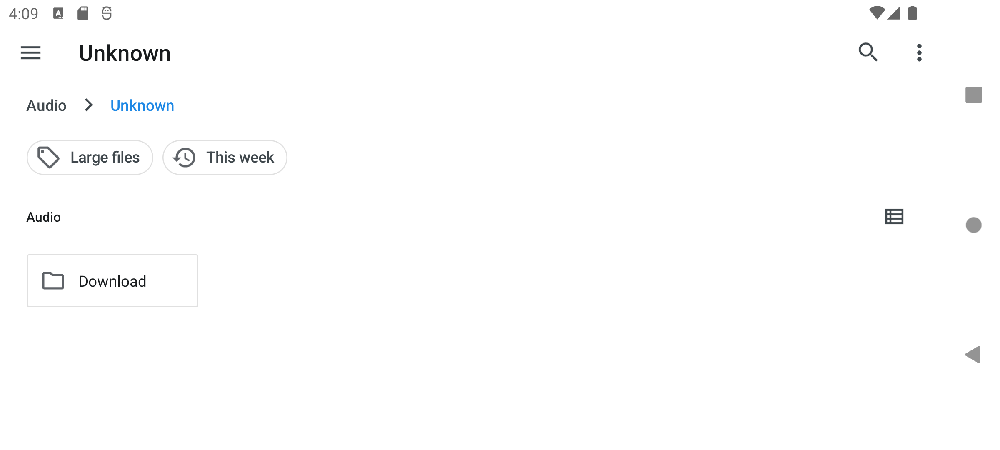
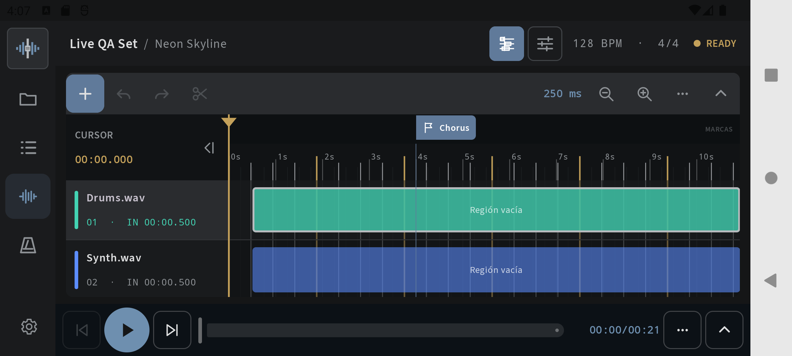

# LiveTracks

<p align="center">
  <a href="README.md"><strong>English</strong></a> · <a href="README.es.md">Español</a>
</p>

<p align="center">
  
</p>

<p align="center">
  <strong>Professional multitrack show playback built for Android.</strong><br>
  Synchronized stems, per-song click, timeline editing, a mix console, and a focused Stage Mode for operating between songs.
</p>

<p align="center">
  <a href="https://github.com/thomrnowtea/livetracks/actions/workflows/android-ci.yml"></a>
  <a href="https://github.com/thomrnowtea/livetracks/releases"></a>
  
  
</p>

> [!IMPORTANT]
> LiveTracks is currently **alpha software**. It is ready for testing, but it should not be trusted for a critical show until the exact phone, audio files, adapters, routing, and output hardware have been rehearsed together.

## The concept

A LiveTracks session follows a straightforward hierarchy:

```text
Project / show
├── Project master: volume, pan, and metronome defaults
└── Playlist
    ├── Song A: independent master and metronome
    │   ├── Drums.wav
    │   ├── Bass.flac
    │   ├── Click.wav  → optional click reference
    │   └── Cues.wav
    └── Song B: independent master, tempo, and stems
```

Each song is a synchronized container of stems. Every stem follows the same audio clock and can be positioned with millisecond precision, mixed, and routed without becoming an independent player that may drift away from the others.

## Screenshots

<p align="center">
  
</p>

<p align="center">
  
  &nbsp;&nbsp;
  
</p>

## Core features

| Area | Capabilities |
|---|---|
| **Projects and playlist** | Multiple shows, reorderable songs, contextual project/song mixers, safe manual Previous/Next navigation, and continuous automatic play-through. |
| **Timeline** | Persistently cached real waveforms, zoom down to 10 ms, draggable playhead, snapping, offsets, non-destructive split, extraction into a new song, and 50-step Undo/Redo. |
| **Metronome and structure** | Per-song BPM and meter, inheritable defaults, optional musical grid, a click-reference stem, and Intro/Verse/Chorus/Bridge/Solo markers. |
| **Mixing** | Adaptive project, song, and stem consoles; per-stem fader, pan, mute, solo, MAIN/MONITOR sends, and meters; Single Mix and Stereo Split output modes. |
| **Live operation** | A clean Stage Mode with large Previous, Play/Pause, Stop, and Next controls, double-tap playback, and automatic continuation. Optional keep-screen-awake and exclusive performance settings. |
| **Audio files** | Native PCM/float WAV; MP3, AAC/M4A, FLAC, and OGG through available Android codecs; empty stems with an explicit duration are also supported. |
| **Distribution** | Signed releases, SHA-256 checksums, and an in-app updater that validates version, package, certificate, and file integrity. |

The interface adapts to portrait and landscape, is available in English and Spanish, and lets performers collapse tools or panels when workspace matters more than editing controls.

## Typical workflow

1. Create a project for the show.
2. Add and order the songs in the playlist.
3. Import each song's stems or create empty regions.
4. Align entrances on the timeline, add section markers, and configure the metronome.
5. Mix levels, pan, mute/solo, and MAIN/MONITOR routing.
6. Validate the physical output with the exact hardware that will be used live.
7. Enter Stage Mode once editing is complete.

## Audio safety

The C++ engine uses one Oboe output stream as its master clock. The realtime callback only mixes preallocated buffers and reads atomic state: it never decodes, accesses storage or the network, calls JNI/UI, or waits on locks.

- `CLICK` and `CUE` stems are created without a MAIN send.
- Designating a stem as the click reference forces it to MONITOR, silences its MAIN send, and suspends the synthesized click.
- A physical route change during playback stops output and requires route revalidation.
- Voice cues are synthesized while editing and played from prerendered audio.
- Bluetooth is considered preview-only because of its latency and variable behavior.

Read [Audio engine](docs/AUDIO_ENGINE.md) and [Hardware compatibility](docs/HARDWARE_COMPATIBILITY.md) before relying on the app on stage.

## Download and install

Official builds are distributed through [GitHub Releases](https://github.com/thomrnowtea/livetracks/releases):

1. Download `LiveTracks.apk` from the selected release.
2. Optionally compare it against `LiveTracks.apk.sha256`.
3. Allow Android to install apps from that source when prompted.
4. For future versions, use **Settings → About → Check for updates**.

The updater never installs silently. Before opening Android's package installer, it validates HTTPS metadata, version, package id, SHA-256, and the APK signing certificate against the installed app.

## Current status and limitations

Official APKs include 32-bit ARM (`armeabi-v7a`), 64-bit ARM (`arm64-v8a`), and emulator (`x86_64`) native code. Packaging support allows installation on those CPU families but is not a physical audio-hardware certification.

The alpha release preloads audio into memory, with a maximum of 16 stems and 512 MB of decoded data per file. The smaller address space and memory budgets of many 32-bit devices make short, conservative test assets especially important. Decoder-worker ring buffers, foreground playback service support, physical Stereo Split/USB validation, and an expanded Live Mode remain pending.

[Implementation status](docs/STATUS.md) is the source of truth for completed and pending work. Physical compatibility claims belong in [Hardware compatibility](docs/HARDWARE_COMPATIBILITY.md); an emulator test is never presented as stage-hardware validation.

## Development

Requirements:

- Android Studio and JDK 17
- Android SDK 35
- Android NDK `27.0.12077973`
- CMake `3.22.1`

```powershell
$env:JAVA_HOME = 'C:\Program Files\Android\Android Studio\jbr'
./gradlew testDebugUnitTest lintDebug verifyDebugApkAbis
adb install -r app/build/outputs/apk/debug/app-debug.apk
```

The project separates `ui`, `domain`, `data`, `audio`, and `cpp`. Dependencies point toward the domain, and the native engine never depends on Android UI or persistence. Builds verify `armeabi-v7a`, `arm64-v8a`, and `x86_64`.

## Documentation

| Document | Contents |
|---|---|
| [Status](docs/STATUS.md) | Completed, partial, pending, and hardware-blocked work. |
| [Architecture](docs/ARCHITECTURE.md) | Layers, data flow, and Kotlin/JNI/C++ boundaries. |
| [Audio engine](docs/AUDIO_ENGINE.md) | Clock, mixing, routing, and realtime constraints. |
| [Testing](docs/TESTING.md) | Local gates, emulator matrix, and physical validation sequence. |
| [Releases](docs/RELEASES.md) | Versioning, signing, assets, and updater contract. |
| [Changelog](CHANGELOG.md) | Notable changes by version. |

## Contributing and reporting issues

Contributions and feedback are welcome. Before opening a PR, read [CONTRIBUTING.md](CONTRIBUTING.md) and run the local verification gates. Use the [bug report form](https://github.com/thomrnowtea/livetracks/issues/new?template=bug_report.yml) for defects and the [feature request form](https://github.com/thomrnowtea/livetracks/issues/new?template=feature_request.yml) for proposals.

Do not disclose vulnerabilities, credentials, private audio, or identifying device data in a public issue. Follow [SECURITY.md](SECURITY.md) for sensitive reports.

## Credits and license

Created and maintained by [thomrnowtea](https://github.com/thomrnowtea). Dependency and font attributions are listed in [THIRD_PARTY_NOTICES.md](THIRD_PARTY_NOTICES.md).

This repository is public for inspection and collaboration, but it currently **does not grant a general license to the source code**. Until a `LICENSE` file is added, applicable rights are reserved; public does not automatically mean open source.
